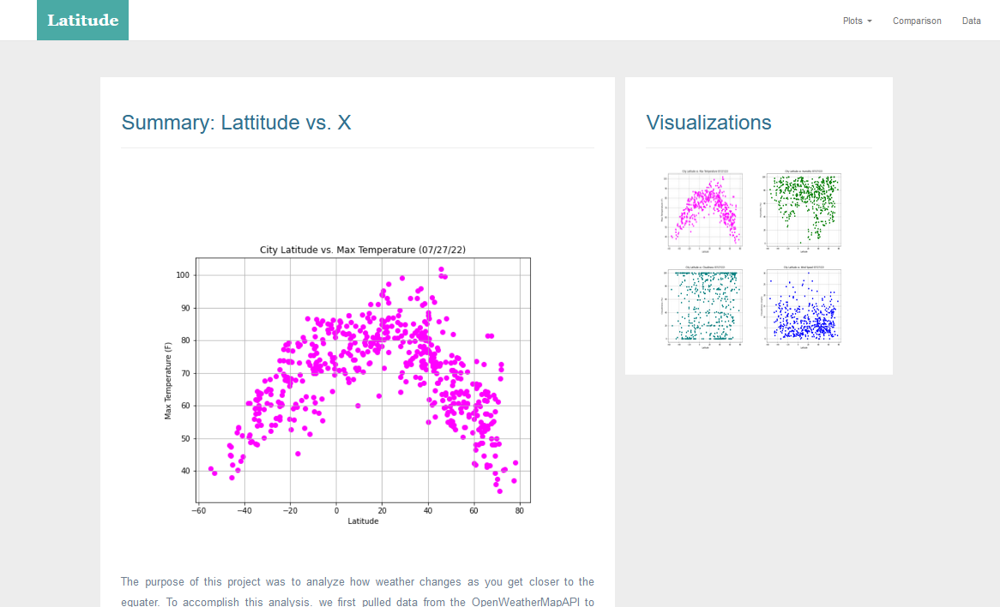
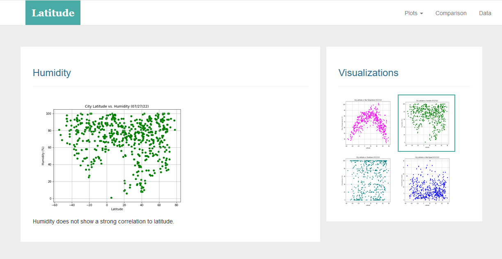
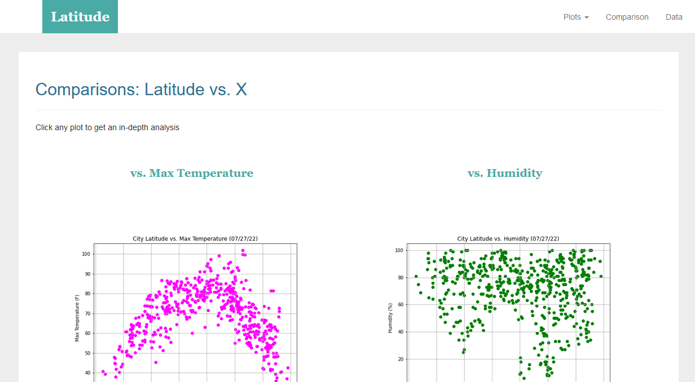
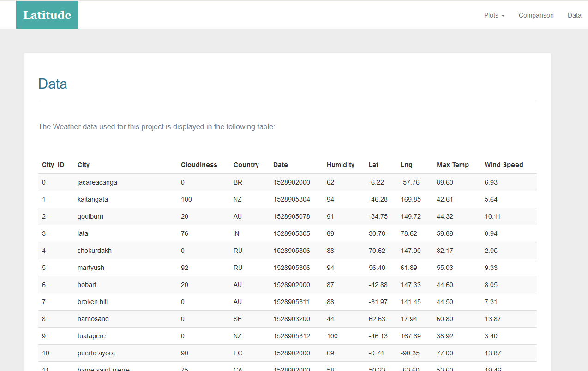
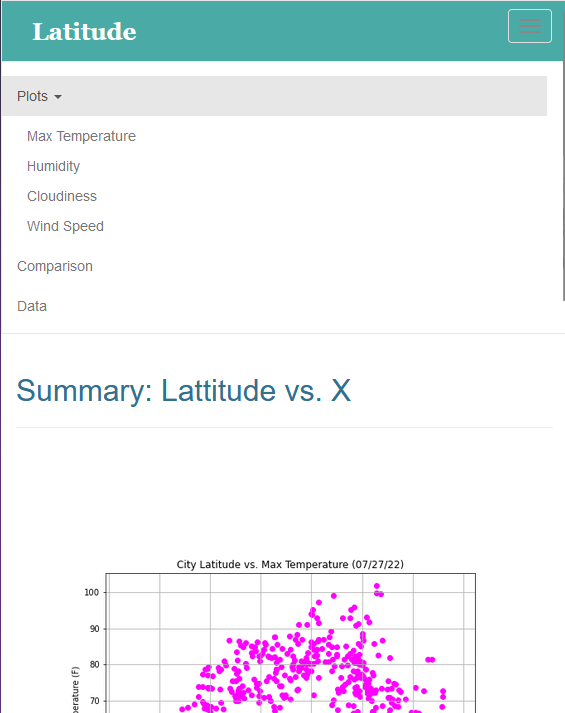

# Unit 11 Homework: Web Visualization Dashboard 

## Background

Data is more powerful when we share it with others! Let's use what we've learned about HTML and CSS to create a dashboard featuring the analysis that we've done, as captured in the following image:

## Instructions 

For this homework assignment, we've created a website by using visualizations that was created in out Python-APIs homework.

As we build this dashboard, individual pages were created for each plot and a way to navigate between them. These pages  contain the visualizations and description. In addition, the landing page provides a comparison of all the plots, along with another page to present the data used to build them.

### Website Requirements

Website can be found [here](https://vedranagatech.github.io/Web-Design-Challenge/index.html)

The website must consist of seven pages in total, including:

* A [#landing-page](https://vedranagatech.github.io/Web-Design-Challenge/index.html) containing the following elements:

  * An explanation of the project

  * Links to each visualizations page. There should be a sidebar containing preview images of each plot. Clicking an image should take the user to that visualization.

  Page#1/7 
    

* Four [visualization pages](https://vedranagatech.github.io/Web-Design-Challenge/visualization/temp.html), stored in the `visualizations` folder, each with the following elements:

  * A descriptive title and heading tag.

  * The plot or visualization for the selected comparison (latitude vs: max temperature, humidity, cloudiness, or wind speed). The images displayed on these pages should be stored in the `assets/images` folder.

  * A paragraph describing the plot and its significance.

  Sample:
    

* A ["Comparisons" page](https://vedranagatech.github.io/Web-Design-Challenge/comparison.html) that does the following:

  * Contains all of the visualizations on the same page so they can easily be compared with each other.

  * Uses a Bootstrap grid for the visualizations.

    * The grid must be two visualizations across medium and large screens, and it must be one visualization across on extra-small or small screens.

  Sample:
      

* A ["Data" page](https://vedranagatech.github.io/Web-Design-Challenge/data.html) that displays a responsive table containing the data used in the visualizations.

  * The table must be a Bootstrap table component.
  * The data must come from exporting the `.csv` file as HTML or by converting it to HTML. .

    Sample:
      

At the top of every page, the website must have a navigation menu with the following elements:

* It should have the name of the site on the left of the navigation bar, allowing users to return to the landing page from any page.
* It should contain a dropdown menu on the right of the navigation bar, named "Plots," to provide links to each individual visualization page.
* It should provide two more text links on the right: "Comparisons," which links to the comparisons page, and "Data," which links to the data page.
* It should be responsive (using media queries). 

    Sample:
  
  
Finally, the website must be deployed to GitHub Pages.

## References

OpenWeatherMap.org. (2012). Сurrent weather and forecast. Retrieved from [https://openweathermap.org/](https://openweathermap.org/)

- - -

© 2022 Trilogy Education Services, a 2U, Inc. brand. All Rights Reserved.

